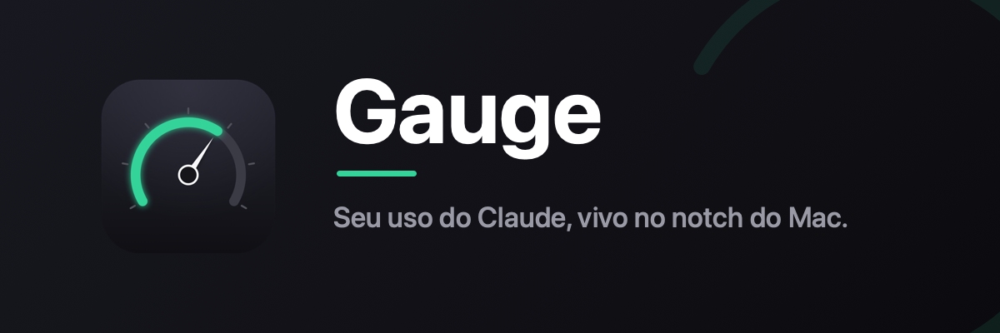
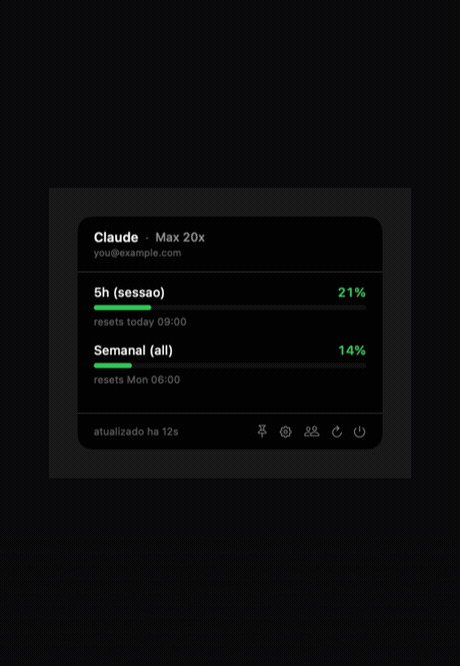
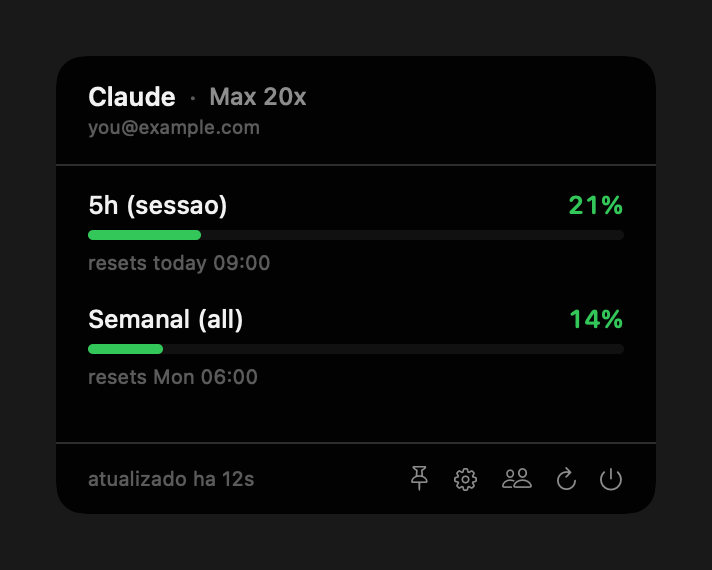
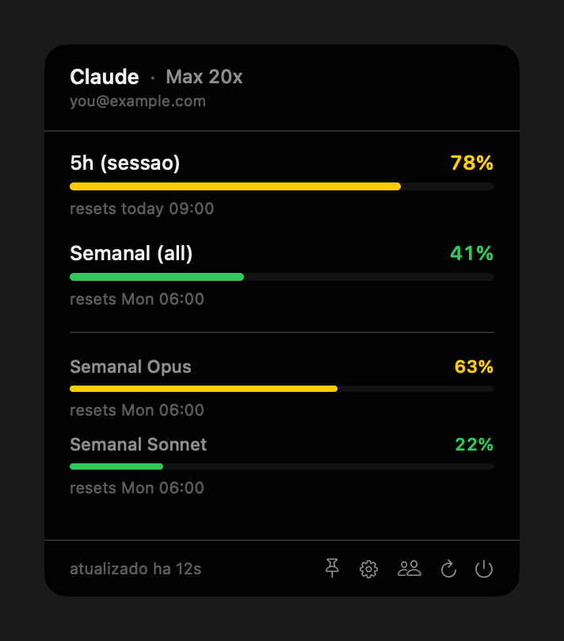
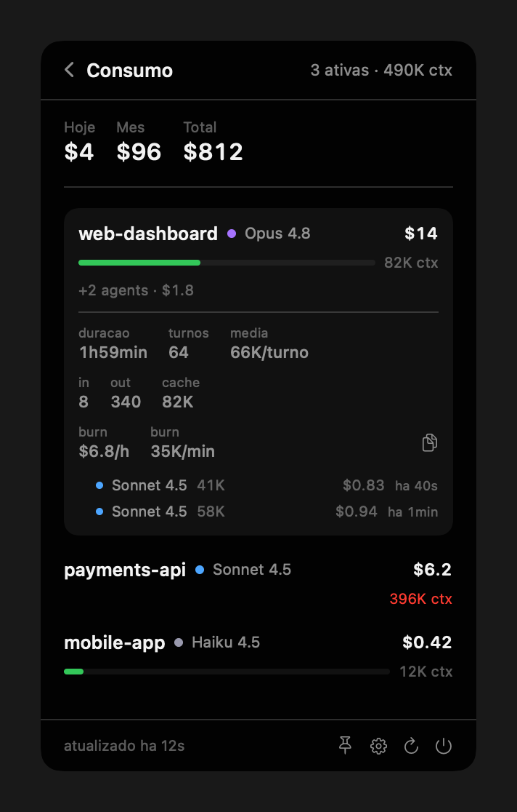
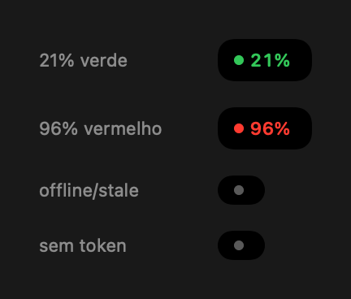

<div align="center">



**Seu uso do Claude, vivo no notch do Mac.**


</div>

---

O **Gauge** transforma o notch, aquele entalhe inútil no topo do seu MacBook, num painel de controle do Claude. Não abre janela, não polui o Dock, não consome token. Você passa o mouse na região do notch e um painel desce, estilo Dynamic Island, mostrando exatamente quanto resta do seu limite. Tira o mouse e ele some.

<div align="center">



</div>

## Por que Gauge

- 🎯 **Medidores ao vivo.** Limite de sessão (5h) e semanal como barra de bateria, coloridos por estado (verde, amarelo, vermelho). No plano Max, ainda separa Opus e Sonnet.
- 🪧 **Vive no notch.** Parado, é invisível: notch normal. No hover, o painel desce. Zero ícone ocupando a menu bar.
- 👁️ **Faixa sempre-visível (opcional).** Uma tira compacta colada no notch com o pior percentual, colorida. Bateu num estado ruim (offline, sem token), vira um ponto cinza discreto em vez de mostrar número errado.
- 💸 **Página Consumo.** Gasto de Hoje, Mês e Total, mais as sessões do Claude Code **rodando agora**: contexto, custo, burn rate e os subagents de cada uma.
- 🔔 **Aviso de teto.** Peek automático quando o pior medidor passa de 90%. Você vê antes de bater a parede.
- 🔢 **Números exatos, não estimativa.** Lê o endpoint oficial `oauth/usage`, o mesmo que a Anthropic usa, que **não consome tokens**.
- 🔒 **Privado por design.** Única saída de rede é `api.anthropic.com`. O token sai do Keychain via `security`. Sem telemetria, sem servidor no meio.
- ⚡ **Nativo e leve.** SwiftUI puro, binário de ~1.9 MB. Nada de Electron.

## Telas

<div align="center">

| Uso (limites) | Uso no plano Max | Consumo (sessões ativas) |
|:---:|:---:|:---:|
|  |  |  |
| 5h + semanal, color-coded | Opus e Sonnet separados | gasto + subagents + burn |

<br>



_A faixa compacta: o pior % colado no notch, ou um dot cinza quando o dado não é confiável._

</div>

## Como funciona

1. **Token.** Lê o OAuth do Keychain (service `Claude Code-credentials`) via `/usr/bin/security`, o mesmo item que o Claude Code já usa. Nenhum token é gasto.
2. **Limites.** `GET /api/oauth/usage` (header `anthropic-beta: oauth-2025-04-20`) alimenta os medidores. `GET /api/oauth/profile` resolve o tier (Max 5x / 20x).
3. **Sessões ativas.** A página Consumo lê `claude agents --json` (fonte oficial das sessões interativas) e enriquece cada uma com um scan incremental dos `.jsonl` do Claude Code (contexto, tokens, modelo) e o custo via `ccusage`.

Tudo local, tudo sob demanda. O painel só faz trabalho quando está aberto.

## Privacidade e segurança

- A **única** conexão de rede é com `api.anthropic.com`.
- Os únicos subprocessos são `security` (Keychain), `claude` (lista de sessões) e `ccusage` (custo).
- O endpoint de uso é de metadados: os números são exatos e **não descontam** da sua cota.
- Nada é enviado pra lugar nenhum. Sem analytics, sem crash reporter, sem telemetria.

## Instalação

Baixe o `.dmg` pronto na aba **[Releases](https://github.com/limawtf/gauge-notch/releases)** (arraste pra Applications). Depois de instalado, o app se atualiza sozinho: aviso discreto no menu da engrenagem, 1 clique.

Ou compile do código. Requisitos: **macOS 13+** e o toolchain do Swift (Xcode ou Command Line Tools). Opcional: `ccusage` global (`npm i -g ccusage`) pra ligar a seção de gasto em dólar.

```bash
git clone https://github.com/limawtf/gauge-notch.git
cd gauge-notch

bash scripts/make-icon.sh     # gera Resources/AppIcon.icns
bash scripts/make-app.sh      # build release + empacota Gauge.app

cp -R Gauge.app /Applications/
open /Applications/Gauge.app
```

Na primeira execução o macOS pede permissão de Keychain (**Sempre Permitir**) pro `security` ler o token. Precisa estar logado no Claude Code, senão não há token pra ler.

## Configuração

No rodapé do painel, o menu de engrenagem tem:

- **Avisar em uso alto**: liga o peek automático em ≥ 90%.
- **Mostrar uso no notch**: liga/desliga a faixa compacta sempre-visível.
- **Abrir no login**: registra o app pra subir junto com o sistema (via `SMAppService`).

## Desenvolvimento

```bash
swift build                   # debug
swift test                    # testes unitarios (Swift Testing)
```

O app roda 100% verificável **sem tela**, via um renderizador headless que exporta a UI pra PNG (`ImageRenderer`, in-process):

```bash
# renderiza qualquer estado do painel num PNG, sem abrir janela
swift run ClaudeNotch --snapshot out.png \
  --state ok|opus|agents|compact --appearance dark|light

# tabela de decisão do scanner de sessões (por que apareceu/sumiu X)
.build/debug/ClaudeNotch --debug-agents
```

Os assets deste README (banner, gif, screenshots) são todos gerados por script, sem ferramenta externa: `scripts/make-icon.sh`, `scripts/make-readme-assets.swift`.

## Stack

- **SwiftUI** + **AppKit** (agente `LSUIElement`, sem Dock)
- [**DynamicNotchKit**](https://github.com/MrKai77/DynamicNotchKit) `1.1.0` pro efeito de painel no notch
- **SwiftPM** executável, empacotado num `.app` ad-hoc por `scripts/make-app.sh`
- Sem dependências de runtime além do sistema

## Estrutura

```
Sources/ClaudeNotch/
  App/     boot, settings, snapshot headless, alert peek
  Data/    Keychain, API oauth/usage, cache, scanner de sessões, ccusage
  Notch/   controller do notch, hotzone de hover, geometria da tela
  UI/      PanelView, medidores, página Consumo, tema
scripts/   make-app.sh, make-icon.sh, icon-gen.swift, make-readme-assets.swift
docs/      assets do README (screenshots, banner, gif)
```

---

<div align="center">

Feito pra quem vive dentro do Claude Code e cansou de bater no limite sem aviso.

</div>
